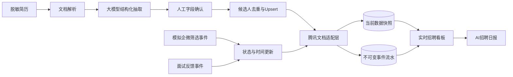

# AI招聘运营台

一个面向招聘数据提效场景的可运行AI应用Demo。它使用脱敏模拟数据展示完整闭环：简历结构化抽取、人工确认、候选人自动建档、状态实时更新、面试反馈同步、事件追踪、招聘看板和AI日报。

## 在线预览与代码

- 在线预览:https://recruitment-ai-ops-demo.streamlit.app/
- 代码仓库：https://github.com/kekeyouguaishou-ux/recruitment-ai-demo

## 业务背景

HR日常通过企业微信、企业微信群和腾讯在线文档推进招聘，需要反复记录候选人信息、面试进度和反馈，容易出现录入效率低、数据遗漏和更新不及时等问题。

本Demo遵循最小成本原则，不替换现有工作载体，仅在流程上增加一层AI理解和自动化能力。招聘方已确认本次作业可以使用脱敏模拟数据和模拟接口，因此项目默认使用可直接运行的`MockTencentDocsAdapter`，同时保留真实腾讯文档适配器边界。

## 核心能力

- PDF、DOCX、TXT和Markdown简历文本解析
- OpenAI兼容大模型结构化抽取，可接入DeepSeek等模型
- 无密钥时使用脱敏演示解析器，保证公开预览可运行
- 每个浏览器会话使用独立演示数据库，互不影响
- 人工确认后自动建档，按手机号或邮箱去重更新
- 模拟企业微信群中的二次筛选和面试反馈操作
- 候选人表、面试表和事件流水实时同步
- 记录创建时间、阶段变化时间、更新时间、下次跟进时间、同步时间和版本号
- 招聘阶段、岗位分布、面试比例、通过率、阶段耗时及超时待办看板
- 基于当前指标生成AI招聘日报，不替代HR作出录用决定
- AI日报仅向模型发送聚合指标，不发送候选人姓名和联系方式
- CSV导出、手机号脱敏、API Key不落库

## 架构



AI负责非结构化简历理解和日报表达；去重、状态更新、时间记录、同步、版本控制和指标计算由确定性程序完成。

## 数据设计

候选人当前快照包含：

```text
candidate_id, name, phone, email, target_position, education,
school, major, skills, source, stage, confidence,
created_at, stage_changed_at, updated_at, next_followup_at, version
```

事件流水包含：

```text
event_id, candidate_id, event_type, from_stage, to_stage,
operator, event_time, sync_target, sync_status, synced_at
```

当前快照便于HR查看最新进度，事件流水用于审计、超时提醒、阶段耗时计算和失败重试。

## 本地运行

建议使用Python 3.11或3.12：

```bash
python -m venv .venv
```

Windows：

```powershell
.venv\Scripts\Activate.ps1
pip install -r requirements.txt
streamlit run app.py
```

启动后访问`http://localhost:8501`。

## 使用真实大模型

在页面侧边栏打开“使用真实大模型抽取”，再填写OpenAI兼容接口的API Key、地址和模型名称。也可以在Streamlit Cloud的Secrets中配置：

```toml
LLM_API_KEY = "your-key"
LLM_BASE_URL = "https://api.deepseek.com"
LLM_MODEL = "deepseek-chat"
```

API Key仅用于当前请求，不写入数据库和同步日志。不要把真实密钥提交到GitHub。

## 测试

```bash
pip install -r requirements-dev.txt
pytest -q
```

测试覆盖候选人去重、版本更新、时间节点、状态事件、面试记录和看板指标。

## 在线部署

1. 将本目录推送到GitHub公开仓库。
2. 登录Streamlit Community Cloud并关联GitHub。
3. 选择仓库、`main`分支和入口文件`app.py`。
4. 如需真实模型，在部署设置中配置Secrets。
5. 部署完成后，将生成的`streamlit.app`链接填写到本README。

## 当前边界

- 招聘方暂未提供企业微信和腾讯文档企业版测试权限，因此使用明确标注的模拟接口。
- `TencentDocsAdapter`已定义稳定接口，但获得官方账号、文档ID和字段模板后才映射真实API。
- 图片型扫描简历需要VLM或OCR服务；当前公开Demo支持带文本层的PDF、DOCX、TXT和Markdown。
- 公开Demo只允许使用虚构或脱敏数据。
